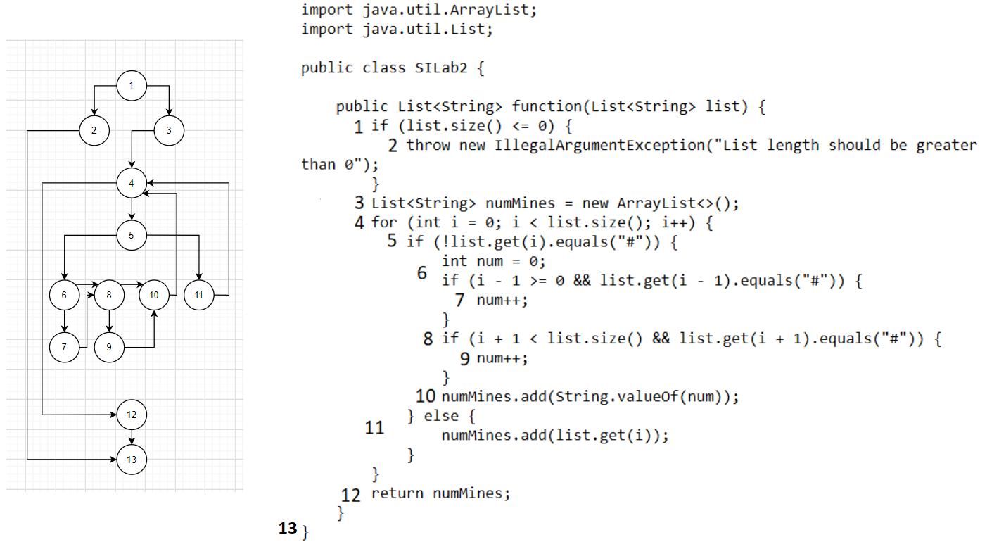

# Втора лабораториска вежба по Софтверско инженерство

## Иван Русевски, бр. на индекс 183012

### Група на код: 

Ја добив групата на код 5

###  Control Flow Graph
 

### Цикломатска комплексност

Цикломатската комплексност на овој код е 5, истата ја добив преку формулата P+1, каде што P е бројот на предикатни јазли. Во случајoв P=4, па цикломатската комплексност изнесува 5.

### Тест случаи според критериумот  Every branch
1-2  
2-13  
1-3  
3-4  
4-5  
5-6  
5-11  
11-4  
6-7  
6-8  
7-8  
8-9  
9-10  
8-10  
10-4  
4-12  
12 -13  
### Тест случаи според критериумот  Every path

1,2,13  
1,3,4(5,6,7,8,9,10,4)12,13  
1,3,4(5,6,8,9,10,4)12,13  
1,3,4(5,6,8,10,4)12,13  
1,3,4(5,6,7,8,10,4)12,13  
1,3,4(5,11,4)12,13  
1,3,4(5,6,7,8,9,10,4,5,11,4)12,13  
1,3,4(5,6,8,9,10,4,5,11,4)12,13  
1,3,4(5,6,7,8,10,4,5,11,4)12,13  
1,3,4(5,6,8,10,4,5,11,4)12,13  
1,3,4,12,13  
1,3,4(5,11,4,5,6,7,8,9,10,4)12,13  
1,3,4(5,11,4,5,6,8,9,10,4)12,13  
1,3,4(5,11,4,5,6,8,10,4)12,13  
1,3,4(5,11,4,5,6,6,8,10,4)12,13  

